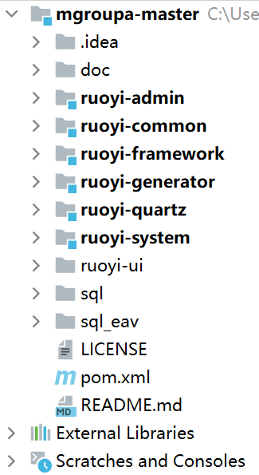
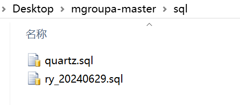

# 效益评估系统环境搭建（V0版）

Author : [Kuang Kehao](https://gitee.com/Kason128)

## 准备工作

```
JDK >= 1.8
MySQL >= 5.7
Maven >= 3.0
```

这里就不在详细概述本地基础环境配置，如有问题，可参考下面文档。

[Java1.8开发环境搭建详细教程（1.JDK安装）](https://blog.csdn.net/nuw7xj/article/details/115750232#:~:text=Java%E5%BC%80%E5%8F%91%E7%8E%AF%E5%A2%83%E7%9A%84%E5%AE%89%E8%A3%85%E5%8F%8A%E9%85%8D%E7%BD%AE%EF%BC%88%E6%96%B0%E6%89%8B%E5%85%A5%E9%97%A8%E5%9E%8B%EF%BC%89%201%201.%20Javajdk%E4%B8%8B%E8%BD%BD%20%E5%AE%98%E7%BD%91%E4%B8%8B%E8%BD%BD%EF%BC%9A%20https%3A%2F%2Fwww.oracle.com%2Fjava%2Ftechnologies%2Fjavase%2Fjavase-jdk8-downloads.html%3B%20%E7%8E%B0%E5%9C%A8%E5%AE%98%E7%BD%91%E4%B8%8B%E8%BD%BD%E8%A6%81%E8%B4%A6%E5%8F%B7%E5%AF%86%E7%A0%81%2C%E8%BF%99%E4%B8%AA%E7%BD%91%E7%AB%99%E9%87%8C%E6%9C%89%E8%B4%A6%E5%8F%B7%E5%AF%86%E7%A0%81%20http%3A%2F%2Fbugmenot.com%2Fview%2Foracle.com,3.%20Java%E7%8E%AF%E5%A2%83%E5%8F%98%E9%87%8F%E7%9A%84%E9%85%8D%E7%BD%AE%20%E6%96%B9%E6%B3%95%E4%B8%80%EF%BC%9A%E6%89%8B%E5%8A%A8%E9%85%8D%E7%BD%AE%20%E5%8F%B3%E5%87%BB%E6%88%91%E7%9A%84%E7%94%B5%E8%84%91%E2%80%93%3E%E5%B1%9E%E6%80%A7%E2%80%93%3E%E9%AB%98%E7%BA%A7%E7%B3%BB%E7%BB%9F%E8%AE%BE%E7%BD%AE%E2%80%93%3E%E7%8E%AF%E5%A2%83%E5%8F%98%E9%87%8F%20%EF%BC%9A%E6%98%BE%E7%A4%BA%E5%87%BA%E4%B8%80%E4%B8%AA%E7%8E%AF%E5%A2%83%E5%8F%98%E9%87%8F%E7%9A%84%E5%9B%BE%EF%BC%8C%E5%A6%82%E5%9B%BE%E6%89%80%E7%A4%BA%20...%204%204.%E6%8C%89Ctrl%2Bs%E5%8F%8D%E5%A4%8D%E4%BF%9D%E5%AD%98%E5%90%8E%E5%85%B3%E9%97%AD%EF%BC%8C%E4%BF%AE%E6%94%B9txt%E6%96%87%E4%BB%B6%E5%90%8D%E5%90%8E%E7%BC%80%E4%B8%BA%22.bat%22%E3%80%82)

[MySQL本地环境搭建](https://blog.csdn.net/weixin_52003205/article/details/132241675?ops_request_misc=%257B%2522request%255Fid%2522%253A%2522172371685016800186564140%2522%252C%2522scm%2522%253A%252220140713.130102334..%2522%257D&request_id=172371685016800186564140&biz_id=0&utm_medium=distribute.pc_search_result.none-task-blog-2~all~sobaiduend~default-2-132241675-null-null.142^v100^pc_search_result_base2&utm_term=%E5%AE%89%E8%A3%85mysol&spm=1018.2226.3001.4187)

[node 官网教程](https://nodejs.org/zh-cn/)

[redis数据库](https://redis.io/)


## 初始化本地环境


[进入git仓库地址](https://gitee.com/itiancong/mgroupa/tree/master/)，下载项目解压到本地。


本地项目代码结构（前后分离版）



后端打开redis 服务


打开Navicat，将sql文件夹下的文件分别复制到Navicat 中运行。





## 修改配置文件

1.application-druid.yml文件：更改为数据库信息


2.application.yml文件：更改redis相关信息


## 运行后台服务

**运行RuoYiApplication这个启动程序,类路径如下:**

```
ruoyi-admin->>src/main/java->>com.ruoyi->>RuoYiApplication
```


出现图标，即运行成功了。


## 运行前台服务

在ruoyi-ui路径下运行命令初始化项目

```
npm install
```


初始化完成后

```
npm run dev
```

运行成功后会自动跳转到浏览器。


自此，若依框架初始化完成。


# 初始化效益评估系统

数据库中导入sql_eav中的所有数据表。


（前期先行创建的，需要再次导入一下 **user_personnel.sql** 这一张表（最后一张表，权限管理的表））

同时可以先增加一下菜单和目录，菜单名（新建项目），目前项目已有代码。

如图：


## 鸣谢项目：

- [若依框架](http://ruoyi.vip/)

  演示地址：[http://vue.ruoyi.vip](https://gitee.com/link?target=http%3A%2F%2Fvue.ruoyi.vip)
  文档地址：[http://doc.ruoyi.vip](https://gitee.com/link?target=http%3A%2F%2Fdoc.ruoyi.vip)


